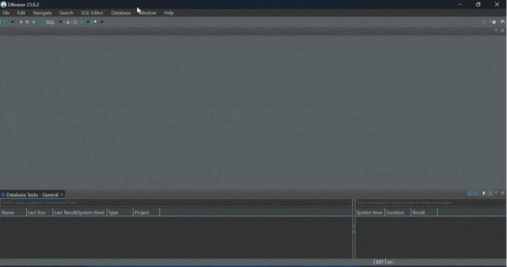

# Passo a Passo para acessar e configurar sua Máquina Virtual
## Criação da VM 
> O primeiro passo é criar uma conta na [Oracle Cloud](https://www.oracle.com/br/cloud/sign-in.html) é permitido ter 1 VM gratuita com até 40GB. Vou deixar como recomendação que siga o tutorial desse [video](https://youtu.be/SIkm9XWgpHA?si=W1xY3frUSj0O997e).

## Requisitos de Instalação SSH (windows)

1. Baixar [OpenSSH](https://learn.microsoft.com/pt-br/windows-server/administration/openssh/openssh_install_firstuse?tabs=gui#install-openssh-for-windows)
2. Extrair Pasta
3. Abrir o Arquivo `scp.exe`
   - Clicar com botão direito e selecionar a opção de abrir via terminal.
4. Digitar Comando no Terminal
 

```shell
   .\ssh.exe -i .\ssh-key-2023-05-05.keyUSER@IP_DA_MAQUINA
```
# Instale o Postgres 

### Atualizar a lista de pacotes e instalar o PostgreSQL:

```bash
sudo apt update
```
```bash
sudo apt install postgresql postgresql-contrib
```
### Verificar o status do serviço PostgreSQL:
```bash
sudo systemctl status postgresql
```
#### Isso deve mostrar que o PostgreSQL está ativo e em execução. Se não estiver, você pode iniciar o serviço com:
```bash
sudo systemctl start postgresql
```

# Habilitando acesso remoto ao postgres
### Primeiros Passos
### Vamos alterar a senha do usuario admin do postgres
#### Digite no terminal
```bash
sudo -u postgres psql
```
#### O resultado desse comando será: 
```bash
postgres=# alter user postgres encrypted password '12345';
```
(Altere a senha de acesso conforme a sua preferência)
#### Em seguida digite `\q`  para sair 

## Alterando arquivo de configuração do postgres 
1. Entre no terminal e digite :  
`sudo nano /etc/postgresql/versao_do_postgres/main/postgresql.conf`
#### Exemplo
```bash
~$ sudo nano /etc/postgresql
~$ sudo nano /etc/postgresql/14/main/
~$ sudo nano /etc/postgresql/14/main/
~$ sudo nano /etc/postgresql/14/main/postgresql.conf
```
### Altere seguinte linha:

### Na Linha :
```bash
### - Connection Settings -

#listen_addresses = 'localhost'                  # what IP address(es) to listen on;
```
### Alterar Para:
```bash
### - Connection Settings -

listen_addresses = '*'                  	 # what IP address(es) to listen on;
```

Para sair do arquivo digite `crtl + X`
Para confirmar alteração `Y` 
Por fim digite `Enter` novamente

2. Precisamos editar também o arquivo pg_hba.conf portanto no terminal digite:

``sudo nano /etc/postgresql/versao_do_postgres/main/pg_hba.conf``

### Na linha: 
```bash
# "local" is for Unix domain socket connections only
local   all             all                                     peer
```
### Alterar para:
```bash
# "local" is for Unix domain socket connections only
local   all             all                                     trust
```

### Na Linha:
```bash
# IPv4 local connections:
host    all             all             127.0.0.1/32               md5
```
### Alterar para:
```bash
# IPv4 local connections:
host    all             all             0.0.0.0/0                  md5
```
Para sair do arquivo digite `crtl + X`
Para confirmar alteração `Y` 
Por fim digite `Enter` novamente

3. Reinicie o PostgreSQL para aplicar as mudanças:

```bash
sudo systemctl restart postgresql
```
## Habilitando porta na Oracle

## Desabilitar Firewall
O postgres vem por padrão com o firewall desabilitado, isso significa que não será possivel estabelecer uma conexão remota no Dbeaver. Portanto para corrigir esse problema digite no terminal:

```bash
sudo ufw disable 
```
```bash
sudo apt install firewalld
```
```bash
sudo systemctl enable firewalld
```
### Selecione o numero da porta que deseja habilitar eu escolhi habilitar a '5432'

```bash
sudo firewall-cmd --permanent --zone=public --add-port=/tcp
```
```bash
sudo firewall-cmd --reload
```

## Criar DataBase call center
```bash
sudo -u postgres
```
```bash
postgres@sever:~$ adm_callcenter
```
```bash
sudo adduser adm_callcenter
```
OUTPUT
```bash
Enter name of role to add: sammy
Shall the new role be a superuser? (y/n) y
```
OUTPUT
```bash
Adding user `adm_callcenter' ...
Adding new group `adm_callcenter' (1002) ...
Adding new user `adm_callcenter' (1002) with group `adm_callcenter' ...
Creating home directory `/home/adm_callcenter' ...
Copying files from `/etc/skel' ...
New password:
Retype new password:
Sorry, passwords do not match.
passwd: Authentication token manipulation error
passwd: password unchanged
Try again? [y/N] y
New password:
Retype new password:
passwd: password updated successfully
Changing the user information for adm_callcenter
Enter the new value, or press ENTER for the default
        Full Name []: callcenter
        Room Number []:
        Work Phone []:
        Home Phone []:
        Other []:
Is the information correct? [Y/n] y
```

## Testando conexão com acesso remoto no Dbeaver
1. Instale o Dbeaver
2. Faça a conexão conforme o gif abaixo, usando: 

- O IP da sua VM disponivel no site da Oracle Cloud, 
- O usuario postgres 
- A sua senha que configuramos no [inicio](#primeiros-passos).

(Para demo acima foram usados dados IP ficticícios )
#### Se você chegou até aqui é por que deu tudo certo né? Espero ter ajudado! Até a próxima.
